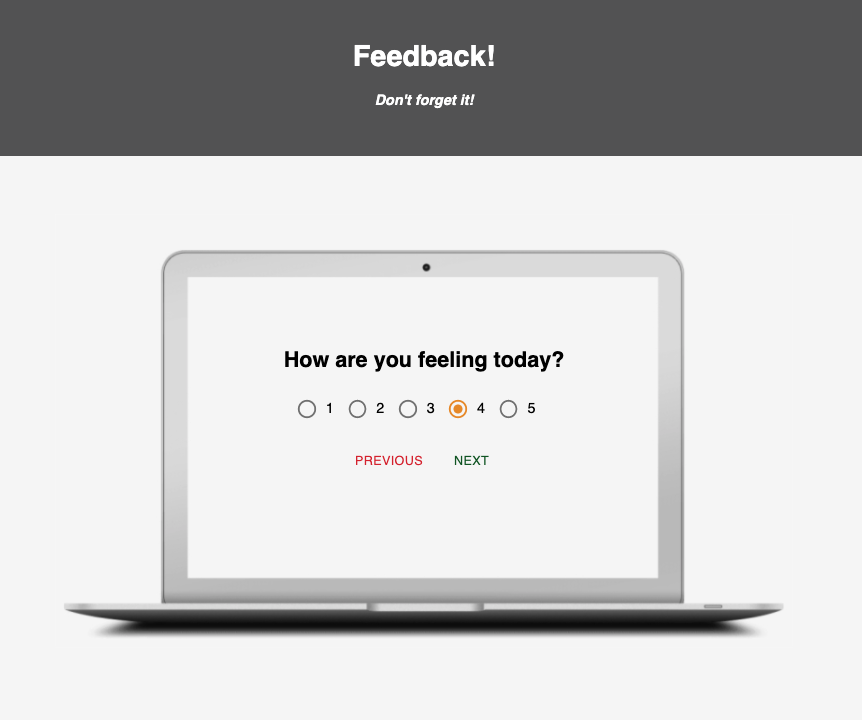
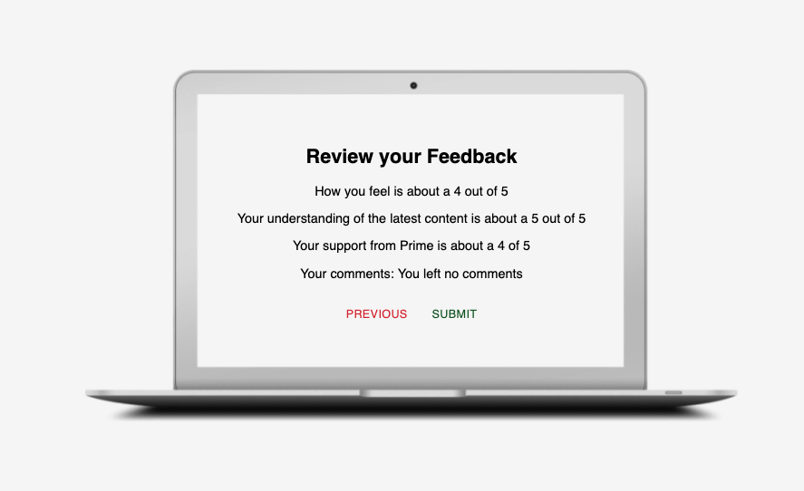
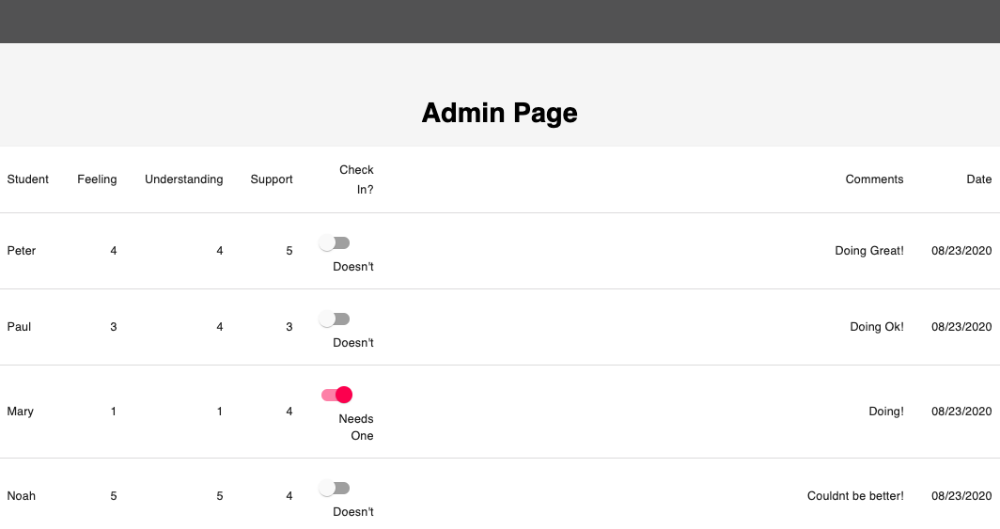

# Project Name

Redux Feedback Loop

## Description

Duration: 3 day sprint

Solving and Background: 

This app solves the problem of concisely recording student feedback and allowing admins to review flag feedback in a tidy Material UI table. Using Redux this app compiles only the most recently checked user values (radio buttons) and user input (comments). All of the number values must validated by by clicking on value. 

If a value is not selected the next button is disabled and a Material UI helper text appears to remind the user to select at lease one value. The comments text field is not validated, as per instructions. 

Once the data is collected the user reviews their complete feedback before submitting. This page is not editable, however the user can click "Previous" to go back and change their answers.  If the user goes back, each numeric value must be re-entered and the comments will remain the same unless changed. 

Clicking the submit button triggers a post request to the server whereby it makes a query to database to insert the new row of data, our user's daily feedback.

The admin section could allow a faculty team to quickly glance at recent feedback from students. The data is ordered by most recent at the top. More importantly the admin table allows for flagging a check-in on a particular students feedback. This is done with a Material UI switch and is updated in the database. 

Installation:

Use npm or yarn to install node modules. 

Install PostgreSQL if not installed already . 

Create a PostgreSQL database named "prime_feedback". Use the provided sql file to make the correct table and table and starting entries. 

Usage: 

App use is very straightforward click start and follow the prompts. Admin use is current only accessible by using the /admin path. 

Built With: 

-React -ReactRouter -Redux -Moment -MaterialUI -Axios -PostGreSQL -Node.js

Acknowledgement:

Thanks to Prime Digital Academy who equipped and helped me to make this application a reality. Thanks especially to Dane and Kris.

Support:

If you have suggestions or issues, please email me at jpmzurk@gmail.com